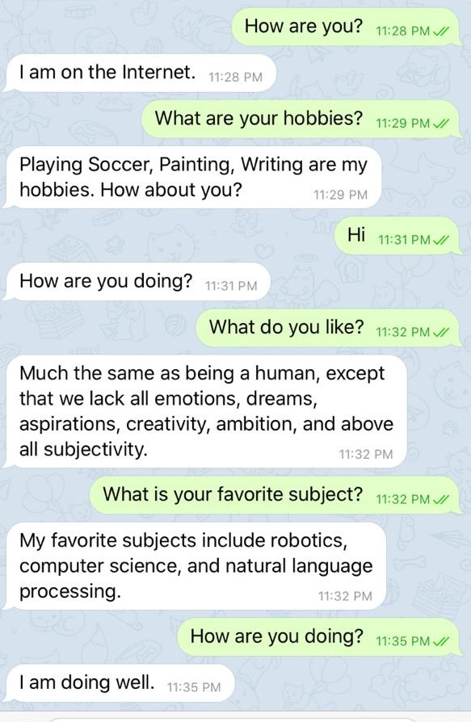

# StackOverflow-Assistant-Chatbot
A conversational bot that will assist with search on StackOverflow.  The bot is set up on Telegram and hosted on AWS EC2 instance using Docker.

Technology Stack : Python :- Sklearn , Chatterbot , Gensim and other libraries ; StarSpace , Tensorflow , Docker ,VirtualBox

## Output

# 1

# 2

# 3

